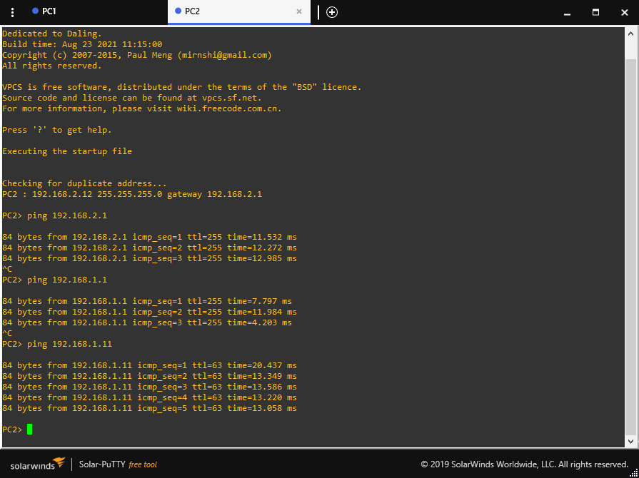
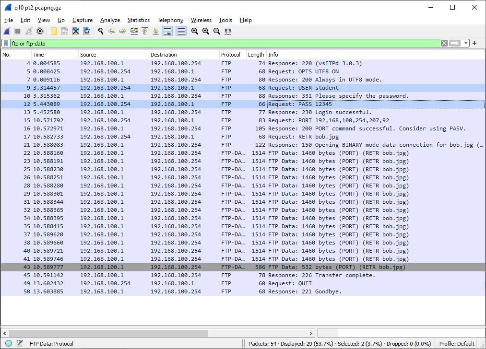
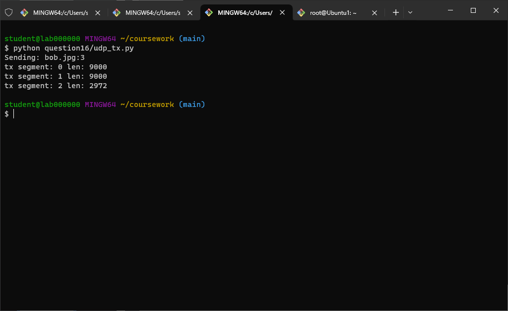
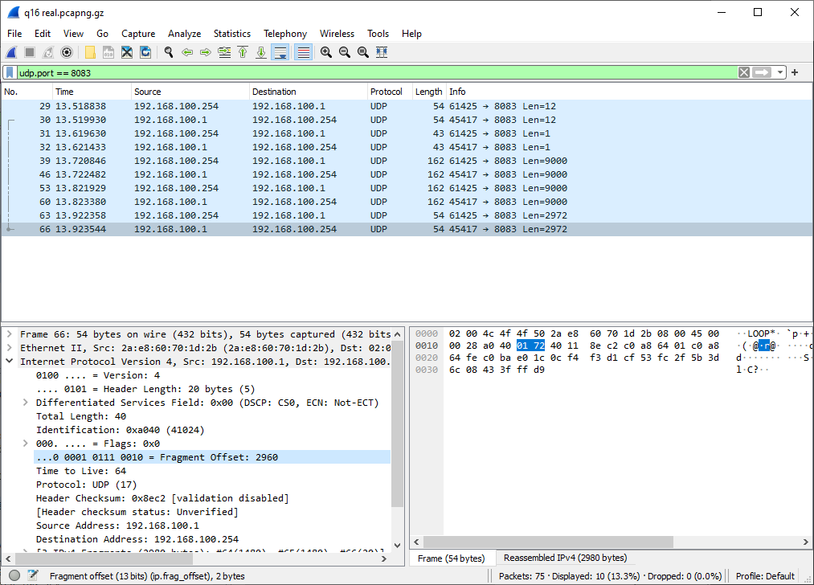
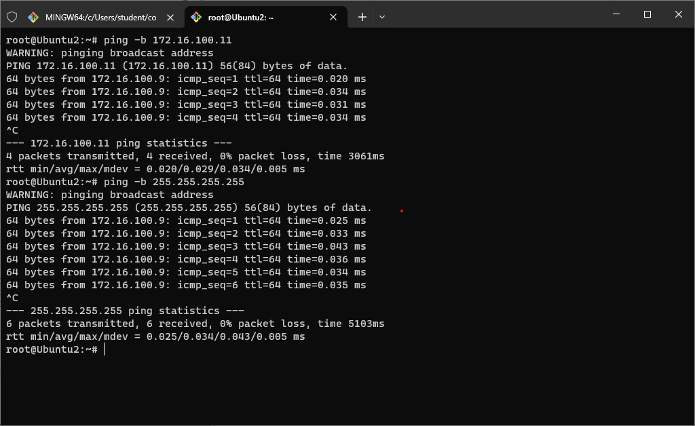

# Answers and Notes

The markdown copy `answers.md` is the source and the pdf copy `answers.pdf` is converted with pandoc.

For associated files i.e. screenshots, fortune.py, see the corresponding directories e.g. question01/ for Question 1. Screenshots should be embedded in the pdf.


## Question 1

jm3017

3 + 0 + 1 + 7

sum 11

config PC1
```
ip 192.168.1.11/24 192.168.1.1
```

config PC2
```
ip 192.168.2.12/24 192.168.2.1
```

config R1
```
configure terminal
interface f0/0
ip address 192.168.1.1 255.255.255.0
no shutdown
exit
interface f0/1
ip address 192.168.2.1 255.255.255.0
no shutdown
exit
router ospf 1
network 0.0.0.0 255.255.255.255 area 0
end
```

ping from PC1
```
ping 192.168.1.1
ping 192.168.2.1
ping 192.168.2.12
```

ping from PC2
```
ping 192.168.2.1
ping 192.168.1.1
ping 192.168.1.11
```

no terminal on R1

### Screenshots




## Question 2

### i.
```python
>>> b = bin(134743044)
>>> b
'0b1000000010000000010000000100'
>>> b = b.removeprefix("0b")
>>> b
'1000000010000000010000000100'
>>> b = b.zfill(32)
>>> b
'00001000000010000000010000000100'
>>> int(b[0:8], 2)
8
>>> int(b[8:16], 2)
8
>>> int(b[16:24], 2)
4
>>> int(b[24:32], 2)
4
```
Answer: 8.8.4.4

### ii.
```python
>>> s = "00001010.10000000.00010001.00001100"
>>> b = s.replace(".", "")
>>> b
'00001010100000000001000100001100'
>>> len(b)
32
>>> int(b[0:8], 2)
10
>>> int(b[8:16], 2)
128
>>> int(b[16:24], 2)
17
>>> int(b[24:32], 2)
12
```
Answer: 10.128.17.12


## Question 3
```
tracert 137.229.113.44
```

Summary: crosses at 163.253.1.120, can tell cause ping, and providers

I estimate the packet crosses to america when it reaches `internet2-gw.mx1.lon.uk.geant.net (62.40.124.45)`. My reasoning is that at this point the round trip time spikes from 11ms to 95ms. This must be because of the physical distance. Also, every prior hop is on JANET.

However, it's more likely it's at the next hop (163.253.1.120), since GEANT is still a European organisation, whereas Internet2 is in the USA. The ping is also higher.

- https://en.wikipedia.org/wiki/JANET
- https://en.wikipedia.org/wiki/G%C3%89ANT
- https://en.wikipedia.org/wiki/Internet2

Note: tracert on the virtual machine didn't work, so I used traceroute on my computer.

### Screenshots


## Question 4
```
telnet 192.168.100.1 80
^]
set localecho
OPTIONS / HTTP/1.1
Host: Ubuntu1
```

### Screenshots


## Question 5
telnetlib fortune

no notes, see question05/fortune.py

### Screenshots


## Question 6
- vnc set up wireshark captures on u1 and u2, filter: smtp
- ssh to u2
- mutt, m for new mail, addr `student@192.168.100.1`, y to send
    - Ubuntu1.local loops back to u2 for some
doesn't work

- wireshark on windows, loopback, filter smtp
- vnc wireshark u1, eth0 or any, filter smtp
- telnet from windows `telnet 192.168.100.1 25`
```
mail from:student@Ubuntu1.local
rcpt to:student@Ubuntu1.local
data
Subject: test message
this is a test email for jm3017 coursework
<enter>.<enter>
```

### Screenshots


## Question 7
- Domain name: google.com
- Top-level domain: com
- Subdomain: www
- The IANA *registrar* ID is 292. IANA does not provide "registrant IDs".
- The "Registry Domain ID" is 2138514_DOMAIN_COM-VRSN.

### Screenshots


## Question 8
Closest root server to Aberdeen is in Dundee, operated by ICANN, address 199.7.83.42, ASN 20144.

Others are shown on the same location on root-servers.org but clicking them reveals all four to be in Edinburgh which is further from Aberdeen.

TTL values:
- york 300s
- google 132s

They differ because they are both constantly decreasing to 0 before being reset, and they aren't in sync because they have different operators.

### Screenshots


## Question 9
dhcp release and request capture

no notes, see screenshots in question09/

todo should be more than one screenshot?

### Screenshots


## Question 10
wireshark windows loopback
```
telnet 192.168.100.1 21

user student
pass 12345
pasv

python question10/ftp_port.py <output>
telnet from result

list
```
filter wireshark by ftp or ftp-data

port used: 20313

### Answer
- Client ports: control 53000, data 53005
- Server ports: control 21, data 20313
- pasv mode is more commonly used because it allows the server to assign a port then you can use the full range of operations

### Screenshots


## Question 11

Summary: not encrypted, see username and password, compare hex dump to packet data

Bob transfer: neither username nor password nor data are encrypted. You can see the credentials sent in plaintext clearly highlighted in the screenshot. You can also see in the wikipedia screenshot that ftp is unencrypted.

To show that the data is also unencrypted, I compare the bytes transferred to the hex dump of the file. Also note the jfif metadata viewable in wireshark.

### Screenshots





## Question 12

from lab6:
`sudo tc qdisc add dev eth1 root netem delay 2500ms`
10s delay:
`sudo tc qdisc add dev eth1 root netem delay 10000ms`

capture u1, eth1, tcp.port == 1234

connect from u1:
`telnet 172.16.100.9 1234`

finally remove the latency from u2
`sudo tc qdisc del dev eth1 root`

### Answer
The RTO varies by doubling each time, starting at the standard one second (1s), then waiting 2s, then 4s, then 8s.

```
1 - 0 = 1
3 - 1 = 2
7.2 - 3 = 4.2, roughly 4
15.4 - 7.2 = 8.2, roughly 8
```

Finally the connection succeeds. In this case the client does not give up, and I successfully ran helo, text, and quit, albeit with the excpected delay. I then disconnected manually.

However I had some inconsistent behaivour, in one case I got some ICMP destination unreachable packets, in another the connection retried unsuccessfuly ad infinitum, although the same thing continued after I removed the delay until I restarted the cowsay server. So it was probably due to the specific order I did things in.

### Screenshots


## Question 13
The server knows this is a new connection because the initial absolute sequence number is randomly selected, and therefore will be different from the initial sequence number used in the first SYN packet from the previous connection.


## Question 14

Summary:
- udp, `length` header field
- tcp, `Data offset`, `MSS`, IP Header `Total length`

In an UDP packet, the size of the data can be determined solely from the value of the "length" section header. Subtract the size of the header, which is always 8 bytes, to get the size of the data.

Conversely, in TCP the size of the header itself is stored in the header. To get the size of the data, you need to subtract the size of the header from the total size of the TCP segment. This can't be found from the header of a sole random TCP packet, you have to get it from either the packet length in the IP header, from which you also need to subtract the size of the IP header, or from the Maximum Segment Size sent during link negotation, assuming conformance with the MSS.

### Cowsay transfer
- run cowsay_big_test.py on windows
- wireshark on u1, eth0, tcp.port == 1234

The PSH flag is set whenever the client has finished transmitting data and is watiting for a response. It's set for "helo", and for "text", then the 8000 characters under the sea are sent in one block of packets with only ACK, which is closed off with a PSH once the whole lot of data is sent. You can see this as the PSH packet from 192.168.100.254 (windows) to 192.168.100.1 (u1) is followed by switching to sending packets from u1 to windows as the server returns the cowsay text.

### Screenshots


## Question 15

Summary: Sum of header and data must be zero, can't be caues of data offset field, then it's bitwise NOT

The final step in the checksum algorithm is the bitwise NOT / one's-complement. Therefore, for a final result of 0xFFFF (1111111111111111), the value prior to the final step must be 0x0000.

The value prior to the final step is calculated by the sum of all the other values in the header and data, as represented by 16-bit one's-complement binary. For the result of a one's-complement sum to be exactly zero (0x0000), the inputs must all be zero. This is not possible for a valid TCP packet since the data offset (tcp header size) must be between 5 and 15.

Therefore, a correctly generated checksum of a valid TCP packet will never have a checksum of 0xFFFF.


## Question 16

### Notes
- wireguard windows loopback, udp.port == 8080
- won't capture this for some reason?
- solution: replace winpcap with npcap

- ok nvm it wants me to demonstrate ip segmentation by sending it across a link
- on u1: `nc -u -l -k -p 8083 | pv | nc -u 192.168.100.254 8083`

### Answer
Three (3) UDP data packets are used in the transfer. If you count the packets for file name and number of segments, that's five.

The fragment off set field is measured in 8-bit bytes. You can see this because the final fragment offset shown in wireshark of 8880 matches the BUF_SIZE of 9000, which is measured in bytes.

Note the question is slightly unclear, this also requires setting BUF_SIZE in udpRX.py to 9000.

### Screenshots








## Question 17
From the PC, pinging these IP addresses gets routed no-where. It's unclear whether you also want me to try from inside Ubuntu?

todo check this ^

on u1, to u2:
```sh
sudo ip tunnel add tun0 mode ipip local 172.16.100.5 remote 172.16.100.9
sudo ip link set tun0 up
sudo ip addr add 10.100.1.2/24 dev tun0
sudo ip route add 10.100.2.0/24 dev tun0
sudo ip route add 10.100.3.0/24 dev tun0

nc -u -l -k -p 8083 | pv | nc -u 10.100.3.2 8083
```
on u2, from u1 and to u3:
```sh
sudo ip tunnel add tun0 mode ipip local 172.16.100.9 remote 172.16.100.5
sudo ip link set tun0 up
sudo ip addr add 10.100.2.2/24 dev tun0
sudo ip route add 10.100.1.0/24 dev tun0


sudo ip tunnel add tun1 mode ipip local 172.16.100.9 remote 172.16.100.13
sudo ip link set tun1 up
sudo ip addr add 10.100.2.3/24 dev tun1
sudo ip route add 10.100.3.0/24 dev tun1
```
on u3, from u2:
```sh
sudo ip tunnel add tun1 mode ipip local 172.16.100.13 remote 172.16.100.9
sudo ip link set tun1 up
sudo ip addr add 10.100.3.2/24 dev tun1
sudo ip route add 10.100.2.0/24 dev tun1
sudo ip route add 10.100.1.0/24 dev tun1

nc -u -l -k -p 8083 | pv | nc -u 192.168.100.254 8083
```
ping tests, run on all:
```sh
ping -c 3 10.100.1.2
ping -c 3 10.100.2.2
ping -c 3 10.100.2.3
ping -c 3 10.100.3.2
```
to reset these, restart devices in gns3 or e.g. `ip route del 10.100.3.0/24`

### Screenshots


## Question 18
to enable broadcast
```sh
sudo sysctl net.ipv4.icmp_echo_ignore_broadcasts=0
```

local broadcast address: 255.255.255.255.

Calculating direct broadcast address for u2 eth1
- eth1's CIDR address: 172.16.100.9/30
- address in binary:
```python
>>> s = "172.16.100.9"

>>> l = s.split(".")
>>> b = [bin(int(x)).removeprefix("0b").zfill(8) for x in l]
>>> b
['10101100', '00010000', '01100100', '00001001']
>>> addr = "".join(b)
>>> addr
'10101100000100000110010000001001'
```
- mask in decimal dot:
```
255.255.255.252
```
- mask in binary:
```python
>>> mask = ("1" * 30).ljust(32, "0")
>>> mask
'11111111111111111111111111111100'
```
- broadcast addr:
```python
>>> broadcast = "10101100000100000110010000001011"
>>> broadcast
'10101100000100000110010000001011'
```
- back to dot notation:
```python
>>> b = broadcast
>>> int(b[0:8], 2)
172
>>> int(b[8:16], 2)
16
>>> int(b[16:24], 2)
100
>>> int(b[24:32], 2)
11
```
- result: 172.16.100.11

disable broadcast ignore for all
```sh
 ssh u1 sysctl net.ipv4.icmp_echo_ignore_broadcasts=0
 ssh u2 sysctl net.ipv4.icmp_echo_ignore_broadcasts=0
 ssh u3 sysctl net.ipv4.icmp_echo_ignore_broadcasts=0
```

finally ping
```sh
ping -b 172.16.100.11
ping -b 255.255.255.255
```

todo why it same both

### Screenshots



## Question 19

### Notes

- /etc/quagga/{ripd,zebra}.conf need to be ready
- wireshark u1 all, rip
- service zebra restart
- service ripd restart
- access router settings:
    - `ssh -L 8000:172.16.100.6:80 root@192.168.100.1`
	- http://127.0.0.1:8000/
	- password: admin

note: starting before it's ready will break the u1 connection, need restart in gns

### Answer

Broadcast address: 172.16.100.7
Routes added: can't see any. actually some are gone.

todo check this again

### Screenshots


## Question 20
u1 any filter icmp

To generate destination unreachable:
`ping 172.16.100.100`

To generate port unreachable:
`echo test | nc -u -u 127.0.0.1 8083`

why does gns3 vm go down at random right now when I'm trying to take the final screenshot

todo final screenshot

### Screenshots


## Appendix

### Lab Index
- 1: ip addresses, traceroute / tracert, latency bandwidth propagation delay
- 2: gns3 config
- 3: http, telnet, python, wireshark, fortune server, mail, mutt mail client, maildir
- 4: dns, whois, dig, dhcp, ntp
- 5: ftp, telnet, python, wireshark, netcat, bob.jpg
- 6: cowsay protocol cwsp, cowsay server, telnet, python, wireshark, tcp, adding latency
- 7: cowsay server, cowsaybigtest, tcp mss maximum segment size, wireshark
- 8: routing, tun device, wireshark, ip route, netcat, router config
- 9: broadcast, direct and local, multicast, rip routing, quagga, router config
- 10: icmp, mac addresses, crc checksums, arp routing, ethernet, cat5 rj45 cables, electronics and waves
